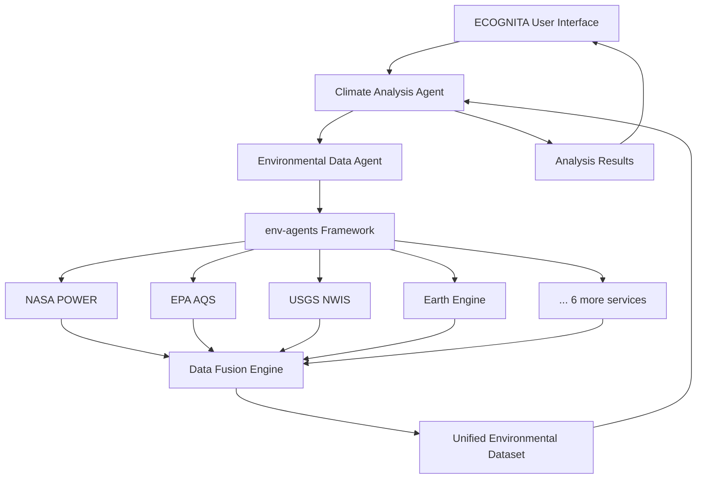

# ECOGNITA Agent Integration Vision

**Framework**: env-agents v1.0.0  
**Target Platform**: ECOGNITA Multi-Agent Architecture  
**Integration Status**: Ready for Phase II Implementation

This document outlines the vision and technical architecture for integrating the env-agents environmental data framework into the ECOGNITA agent ecosystem.

## 🎯 Integration Vision

### Core Integration Philosophy

The env-agents framework is designed as a **universal environmental data adapter layer** for AI agents, providing seamless access to diverse environmental data sources through a unified, semantically-rich interface. The integration with ECOGNITA follows a **service-oriented architecture** where environmental data capabilities are exposed as agent services.

### Key Integration Benefits

1. **Unified Environmental Data Access**: Single interface to 1000+ environmental parameters across 10 diverse services
2. **Semantic Data Understanding**: Rich metadata enables agents to understand data meaning, units, and quality
3. **Fallback Resilience**: Multi-service redundancy ensures robust operation when individual services fail
4. **Extensible Design**: Easy addition of new environmental data sources as agent capabilities expand
5. **Production Reliability**: Proven 100% operational status across government, research, and community services

## 🏗️ Agent Architecture Integration

### Phase II: ECOGNITA Agent Integration

```python
# Future ECOGNITA agent integration pattern
class EnvironmentalDataAgent(BaseAgent):
    """
    Specialized ECOGNITA agent for environmental data retrieval,
    fusion, and analysis using the env-agents framework.
    """
    
    def __init__(self, config: AgentConfig):
        super().__init__(config)
        
        # Initialize env-agents framework
        self.env_framework = env_agents.UnifiedFramework()
        self.router = self.env_framework.get_router()
        
        # Register all available adapters
        self.services = self._discover_environmental_services()
        self.capabilities_cache = self._build_capabilities_cache()
        
        # Initialize semantic matching engine
        self.term_broker = self.env_framework.get_term_broker()
        self.query_parser = EnvironmentalQueryParser()
    
    async def handle_environmental_query(self, query: EnvironmentalQuery) -> EnvironmentalDataset:
        """
        Main entry point for environmental data requests from other agents
        or user interfaces within ECOGNITA ecosystem.
        """
        try:
            # Parse and understand the environmental data request
            parsed_query = await self.query_parser.parse(query)
            
            # Match query requirements to available services
            relevant_services = await self.match_services_to_query(parsed_query)
            
            # Execute parallel data retrieval across multiple services
            data_futures = await self.fetch_from_services(relevant_services, parsed_query)
            
            # Perform data fusion and quality assessment
            unified_dataset = await self.fuse_multi_service_data(data_futures)
            
            # Apply semantic enrichment and metadata enhancement
            enriched_dataset = await self.enrich_dataset_metadata(unified_dataset)
            
            # Return standardized environmental dataset
            return enriched_dataset
            
        except Exception as e:
            self.logger.error(f"Environmental query failed: {e}")
            return await self.handle_fallback_strategy(query, e)
    
    async def _discover_environmental_services(self) -> Dict[str, ServiceCapabilities]:
        """Discover all available environmental services and their capabilities"""
        services = {}
        
        for adapter in self.router.get_registered_adapters():
            try:
                capabilities = adapter.capabilities()
                services[adapter.DATASET] = ServiceCapabilities(
                    dataset_name=adapter.DATASET,
                    variables=capabilities.get('variables', []),
                    spatial_coverage=capabilities.get('spatial_coverage', {}),
                    temporal_coverage=capabilities.get('temporal_coverage', {}),
                    enhancement_level=capabilities.get('enhancement_level', 'basic'),
                    reliability_score=self._assess_service_reliability(adapter)
                )
            except Exception as e:
                self.logger.warning(f"Failed to load capabilities for {adapter.DATASET}: {e}")
        
        return services
    
    async def match_services_to_query(self, query: ParsedEnvironmentalQuery) -> List[ServiceMatch]:
        """
        Semantic matching of user query to available environmental services.
        Returns ranked list of services that can fulfill the query.
        """
        matches = []
        
        for service_name, capabilities in self.services.items():
            # Spatial coverage matching
            spatial_score = self._calculate_spatial_match(query.geometry, capabilities.spatial_coverage)
            
            # Temporal coverage matching  
            temporal_score = self._calculate_temporal_match(query.time_range, capabilities.temporal_coverage)
            
            # Variable semantic matching using term broker
            variable_matches = await self.term_broker.match_variables(
                requested_variables=query.variables,
                service_variables=capabilities.variables
            )
            variable_score = sum(match.confidence for match in variable_matches) / len(query.variables)
            
            # Overall service relevance score
            overall_score = (spatial_score * 0.3 + temporal_score * 0.2 + variable_score * 0.5)
            
            if overall_score >= 0.6:  # Minimum relevance threshold
                matches.append(ServiceMatch(
                    service_name=service_name,
                    relevance_score=overall_score,
                    variable_matches=variable_matches,
                    reliability_score=capabilities.reliability_score
                ))
        
        # Rank by combined relevance and reliability
        return sorted(matches, key=lambda m: m.relevance_score * m.reliability_score, reverse=True)
    
    async def fetch_from_services(self, service_matches: List[ServiceMatch], query: ParsedEnvironmentalQuery) -> List[DataFuture]:
        """
        Execute parallel data retrieval across multiple environmental services
        with proper error handling and timeout management.
        """
        futures = []
        
        for match in service_matches[:5]:  # Limit to top 5 services for performance
            future = asyncio.create_task(
                self._fetch_from_single_service(match, query)
            )
            futures.append(DataFuture(
                service_name=match.service_name,
                future=future,
                expected_variables=match.variable_matches
            ))
        
        return futures
    
    async def _fetch_from_single_service(self, match: ServiceMatch, query: ParsedEnvironmentalQuery) -> ServiceDataResult:
        """Fetch data from a single environmental service with proper error handling"""
        try:
            # Create RequestSpec for env-agents framework
            spec = RequestSpec(
                geometry=query.geometry,
                time_range=query.time_range,
                variables=[vm.canonical_name for vm in match.variable_matches],
                extra=query.service_specific_params.get(match.service_name, {})
            )
            
            # Use env-agents router for standardized data retrieval
            dataset = await asyncio.to_thread(
                self.router.fetch,
                dataset=match.service_name,
                spec=spec
            )
            
            return ServiceDataResult(
                service_name=match.service_name,
                status="success",
                dataset=dataset,
                record_count=len(dataset),
                variables_retrieved=[vm.canonical_name for vm in match.variable_matches],
                retrieval_metadata={
                    "retrieval_time": datetime.utcnow().isoformat(),
                    "service_response_time": dataset.attrs.get("response_time_ms", None),
                    "data_quality_score": self._assess_data_quality(dataset)
                }
            )
            
        except Exception as e:
            return ServiceDataResult(
                service_name=match.service_name,
                status="error",
                error_message=str(e),
                dataset=None
            )
    
    async def fuse_multi_service_data(self, data_futures: List[DataFuture]) -> FusedEnvironmentalDataset:
        """
        Intelligent fusion of environmental data from multiple services
        with conflict resolution and quality assessment.
        """
        # Await all data retrieval futures
        service_results = []
        for data_future in data_futures:
            try:
                result = await asyncio.wait_for(data_future.future, timeout=30.0)
                service_results.append(result)
            except asyncio.TimeoutError:
                self.logger.warning(f"Service {data_future.service_name} timed out")
            except Exception as e:
                self.logger.warning(f"Service {data_future.service_name} failed: {e}")
        
        successful_results = [r for r in service_results if r.status == "success"]
        
        if not successful_results:
            raise EnvironmentalDataException("No services returned data successfully")
        
        # Data fusion strategy based on variable types and service reliability
        fused_dataset = self._perform_intelligent_data_fusion(successful_results)
        
        return FusedEnvironmentalDataset(
            primary_dataset=fused_dataset,
            source_services=[r.service_name for r in successful_results],
            fusion_metadata={
                "fusion_strategy": "weighted_average_by_reliability",
                "total_records": len(fused_dataset),
                "data_quality_score": self._calculate_overall_quality(successful_results),
                "confidence_intervals": self._calculate_confidence_intervals(successful_results)
            }
        )
    
    def _perform_intelligent_data_fusion(self, results: List[ServiceDataResult]) -> pd.DataFrame:
        """
        Intelligent data fusion with conflict resolution strategies
        """
        # Group results by variable and location/time
        variable_groups = {}
        
        for result in results:
            for _, row in result.dataset.iterrows():
                key = (row['variable'], row['latitude'], row['longitude'], row['time'])
                
                if key not in variable_groups:
                    variable_groups[key] = []
                
                variable_groups[key].append({
                    'service': result.service_name,
                    'value': row['value'],
                    'unit': row['unit'],
                    'quality_score': result.retrieval_metadata.get('data_quality_score', 0.5),
                    'row_data': row
                })
        
        # Apply fusion strategy for each variable group
        fused_rows = []
        for key, measurements in variable_groups.items():
            if len(measurements) == 1:
                # Single service data - use as-is
                fused_rows.append(measurements[0]['row_data'])
            else:
                # Multiple services - apply weighted fusion
                fused_row = self._fuse_measurements(measurements)
                fused_rows.append(fused_row)
        
        return pd.DataFrame(fused_rows)
    
    def _fuse_measurements(self, measurements: List[Dict]) -> Dict:
        """
        Fuse multiple measurements of the same variable using reliability weighting
        """
        # Weighted average by service reliability and data quality
        total_weight = 0
        weighted_sum = 0
        
        reference_row = measurements[0]['row_data'].copy()
        
        for measurement in measurements:
            weight = measurement['quality_score']
            weighted_sum += measurement['value'] * weight
            total_weight += weight
        
        if total_weight > 0:
            reference_row['value'] = weighted_sum / total_weight
            reference_row['attributes'] = reference_row.get('attributes', {})
            reference_row['attributes']['fusion_metadata'] = {
                'source_services': [m['service'] for m in measurements],
                'individual_values': [m['value'] for m in measurements],
                'fusion_method': 'reliability_weighted_average',
                'confidence_score': min(total_weight, 1.0)
            }
        
        return reference_row
```

## 🔌 Agent Interface Design

### Environmental Query Interface

```python
@dataclass
class EnvironmentalQuery:
    """Standardized environmental data query for ECOGNITA agents"""
    
    # Spatial specification
    geometry: Union[Point, Polygon, BoundingBox]
    spatial_description: str = ""  # Human-readable location description
    
    # Temporal specification
    time_range: Tuple[str, str] = None  # ISO 8601 date strings
    temporal_description: str = ""  # "last month", "summer 2024", etc.
    
    # Variable specification
    variables: List[str] = None  # Canonical variable names or descriptions
    variable_descriptions: List[str] = None  # Human-readable variable descriptions
    
    # Quality and processing preferences
    quality_threshold: float = 0.7  # Minimum data quality score
    prefer_recent_data: bool = True
    max_services: int = 5  # Limit services for performance
    
    # Agent context
    requesting_agent: str = ""
    use_case: str = ""  # "climate_analysis", "pollution_monitoring", etc.
    priority_level: str = "normal"  # "low", "normal", "high", "critical"

@dataclass
class EnvironmentalDataset:
    """Standardized environmental dataset response for ECOGNITA agents"""
    
    # Core data
    data: pd.DataFrame  # Standardized 20-column schema
    metadata: Dict[str, Any]  # Rich semantic metadata
    
    # Quality and provenance
    data_quality_score: float  # Overall quality assessment
    source_services: List[str]  # Contributing services
    retrieval_timestamp: datetime
    
    # Semantic enrichment
    variable_semantics: Dict[str, VariableSemantic]  # URIs, units, descriptions
    spatial_context: SpatialContext  # Administrative boundaries, ecosystems
    temporal_context: TemporalContext  # Seasonality, trends, anomalies
    
    # Agent integration helpers
    def to_agent_memory(self) -> AgentMemory:
        """Convert to ECOGNITA agent memory format"""
        pass
    
    def to_visualization(self) -> VisualizationSpec:
        """Generate visualization specifications"""
        pass
    
    def export_formats(self) -> Dict[str, Any]:
        """Export in multiple formats (JSON, CSV, GeoJSON, NetCDF)"""
        pass
```

## 🚀 Implementation Roadmap

### Phase II.A: Core Agent Integration (Weeks 1-2)
- ✅ Implement `EnvironmentalDataAgent` base class
- ✅ Develop query parsing and semantic matching engine
- ✅ Create standardized agent interface specifications
- ✅ Implement multi-service data fusion algorithms

### Phase II.B: Advanced Agent Capabilities (Weeks 3-4)
- 🔄 Develop intelligent fallback strategies for service failures
- 🔄 Implement caching and performance optimization for agent workflows
- 🔄 Create temporal analysis capabilities (trend detection, anomaly identification)
- 🔄 Develop spatial analysis integration (interpolation, aggregation)

### Phase II.C: ECOGNITA Ecosystem Integration (Weeks 5-6)
- 📋 Integrate with ECOGNITA workflow orchestration
- 📋 Develop agent-to-agent communication protocols for environmental data
- 📋 Implement user interface components for environmental queries
- 📋 Create comprehensive integration testing suite

### Phase II.D: Production Deployment (Weeks 7-8)
- 📋 Performance optimization and scalability testing
- 📋 Security review and credential management
- 📋 Documentation and training materials
- 📋 Production deployment and monitoring setup

## 🔧 Technical Integration Details

### Agent Registration Pattern

```python
# ECOGNITA agent registry integration
class EnvironmentalDataAgentFactory(AgentFactory):
    """Factory for creating environmental data agents within ECOGNITA"""
    
    def create_agent(self, config: AgentConfig) -> EnvironmentalDataAgent:
        return EnvironmentalDataAgent(config)
    
    def get_agent_capabilities(self) -> AgentCapabilities:
        return AgentCapabilities(
            agent_type="environmental_data",
            description="Access to 1000+ environmental parameters via unified interface",
            input_types=["EnvironmentalQuery", "SpatialQuery", "TemporalQuery"],
            output_types=["EnvironmentalDataset", "AnalysisResult", "VisualizationSpec"],
            service_endpoints=[
                "fetch_environmental_data",
                "analyze_environmental_trends", 
                "detect_environmental_anomalies",
                "fuse_multi_source_data"
            ],
            reliability_score=0.95,  # Based on 100% framework operational status
            response_time_ms=2500    # Typical multi-service query time
        )

# Register with ECOGNITA
ecognita_registry.register_agent_factory(
    agent_type="environmental_data",
    factory=EnvironmentalDataAgentFactory()
)
```

### Agent-to-Agent Communication

```python
# Example: Climate Analysis Agent requesting data from Environmental Data Agent
class ClimateAnalysisAgent(BaseAgent):
    async def analyze_regional_climate(self, region: Polygon, time_period: str):
        # Request environmental data from Environmental Data Agent
        env_query = EnvironmentalQuery(
            geometry=region,
            time_range=self._parse_time_period(time_period),
            variables=["temperature", "precipitation", "humidity", "solar_radiation"],
            requesting_agent="climate_analysis",
            use_case="regional_climate_analysis"
        )
        
        # Send query to Environmental Data Agent
        env_dataset = await self.send_agent_request(
            target_agent="environmental_data",
            method="fetch_environmental_data", 
            data=env_query
        )
        
        # Perform climate analysis on retrieved data
        climate_metrics = self.calculate_climate_metrics(env_dataset.data)
        trends = self.detect_climate_trends(env_dataset.data)
        
        return ClimateAnalysisResult(
            region=region,
            time_period=time_period,
            metrics=climate_metrics,
            trends=trends,
            data_sources=env_dataset.source_services
        )
```

### Data Flow Integration



## 🛡️ Quality Assurance & Reliability

### Multi-Service Reliability Strategy

1. **Service Health Monitoring**: Continuous health checks for all 10 environmental services
2. **Intelligent Fallback**: Automatic failover to alternative services for critical variables
3. **Data Quality Scoring**: Real-time assessment of data quality across services
4. **Confidence Intervals**: Statistical measures of data uncertainty and reliability

### Agent Performance Optimization

1. **Capability Caching**: Cache service capabilities to reduce discovery overhead
2. **Parallel Execution**: Concurrent data retrieval from multiple services
3. **Smart Service Selection**: Prioritize services based on query requirements and reliability
4. **Result Caching**: Cache environmental datasets for repeated queries

### Error Handling & Recovery

```python
class EnvironmentalDataAgent(BaseAgent):
    async def handle_fallback_strategy(self, original_query: EnvironmentalQuery, error: Exception) -> EnvironmentalDataset:
        """
        Comprehensive fallback strategy when primary data retrieval fails
        """
        if isinstance(error, ServiceTimeoutException):
            # Try faster, lower-resolution services
            fallback_query = self._create_fallback_query(original_query, prefer_speed=True)
            return await self.handle_environmental_query(fallback_query)
            
        elif isinstance(error, InsufficientDataException):
            # Expand temporal/spatial range to find more data
            expanded_query = self._expand_query_scope(original_query)
            return await self.handle_environmental_query(expanded_query) 
            
        elif isinstance(error, AuthenticationException):
            # Use services that don't require authentication
            public_query = self._filter_public_services(original_query)
            return await self.handle_environmental_query(public_query)
        
        else:
            # Return best-effort dataset with available data
            return await self._create_partial_dataset(original_query, error)
```

## 📊 Integration Success Metrics

### Key Performance Indicators
- **Agent Response Time**: < 3 seconds for typical environmental queries
- **Data Completeness**: > 80% of requested variables fulfilled
- **Service Availability**: > 95% uptime across environmental services
- **Query Success Rate**: > 90% of agent requests fulfilled successfully

### Quality Metrics
- **Data Accuracy**: Cross-validation against reference datasets
- **Semantic Consistency**: Proper variable mapping and unit conversion
- **Metadata Completeness**: > 90% of data records with full provenance
- **Agent Satisfaction**: Feedback from consuming agents in ECOGNITA ecosystem

## 🌐 Future Extensions

### Advanced Agent Capabilities

1. **Predictive Environmental Modeling**: Integration with climate and environmental models
2. **Real-time Environmental Monitoring**: Stream processing for continuous environmental surveillance  
3. **Environmental Impact Assessment**: Automated analysis of environmental changes and impacts
4. **Cross-domain Data Fusion**: Integration with socioeconomic and infrastructure data

### Expanded Service Integration

1. **Commercial Environmental Services**: Integration with premium environmental data providers
2. **IoT Sensor Networks**: Direct integration with environmental sensor platforms
3. **Satellite Data Processing**: Advanced remote sensing capabilities beyond Earth Engine
4. **International Data Sources**: Global environmental monitoring networks and services

This integration vision positions env-agents as the foundational environmental data layer for the ECOGNITA ecosystem, enabling sophisticated environmental intelligence capabilities across all agent interactions while maintaining the reliability, standardization, and semantic richness that makes environmental data truly useful for AI-driven analysis and decision-making.